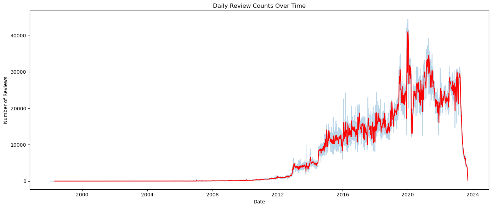

# Amazon Review Near-Duplicate Detection
#### Big Data and Cloud Computing, University of Chicago | Dec 2025

## Question
How much of what people write in Amazon reviews is reused, and can near-duplicate reviews be found at this scale? I focused on the Automotive category, which is the largest category in the product metadata.

## Data and Cleaning
The data has 64.7M reviews (52.4GB) and 4.3M product records, stored in Google Cloud Storage and processed with PySpark on a Dataproc cluster. Cleaning steps:

- Removed 88,032 reviews with empty text or a negative helpful-vote count
- Converted millisecond timestamps to datetimes
- Parsed price strings such as "from 49.50" into numbers, and set non-numeric prices to null
- Kept only the review and product columns used in the analysis

## Review Volume Over Time

Reviews run from 1998 to September 2023. Volume grows from 2012 and peaks between 2019 and 2021, with regular increases around December and July. From December 12, 2019 to January 12, 2020, daily counts stay near 40,000, well above any other holiday season in the data, so I flagged that period as an outlier and left it out of the trend plots instead of treating it as normal holiday demand.

## Exact Duplicates in Automotive
Across all Automotive reviews, 60.8% of review titles and 18.3% of review texts appear more than once. Most repeats are very short:

| Review text | Times it appears |
|---|---|
| Good | 53,254 |
| Great | 39,557 |
| Great product | 38,898 |
| Works great | 36,991 |
| Perfect | 28,270 |

Most texts appear once, but a small set of generic phrases repeats tens of thousands of times.

## Near-Duplicates with MinHash LSH
Exact matching misses reviews that are copied with small edits, so I used MinHash LSH:

1. Took a 1% random sample of Automotive reviews. The full category was too large to run pairwise matching on the course cluster.
2. Removed punctuation and stopwords, and kept reviews with at least three remaining words, since one-word reviews were already covered above.
3. Turned each review into a word set with CountVectorizer and fit MinHashLSH with 5 hash tables.
4. Treated two reviews as near-duplicates when their Jaccard similarity was 0.8 or higher.

9,202 of the 286,750 sampled reviews (3.2%) had a near-duplicate in the sample. Within each of the five most-reviewed products, near-duplicates were almost absent (2 reviews in total).

## Limitations

- **The 3.2% is a lower bound.** Sampling reviews at random means a review's match is only found if the match was also sampled. Sampling by product, keeping every review of each selected product, would keep within-product duplicates intact.
- **Comparing time periods.** Pre-2022 reviews had a near-duplicate rate of 3.4% and 2022–2023 reviews had 1.2%, but the older group is about four times larger, which by itself raises the chance of finding a match. I would compare equal-sized samples before reading this as a real decline.

Code: [Data Cleaning](https://github.com/sharon-lee78/portfolio/blob/main/amazon-reviews/1_data_cleaning.ipynb) · [EDA](https://github.com/sharon-lee78/portfolio/blob/main/amazon-reviews/2_eda.ipynb) · [Analysis](https://github.com/sharon-lee78/portfolio/blob/main/amazon-reviews/3_analysis.ipynb)
