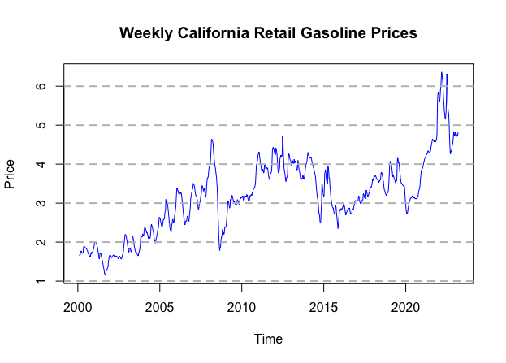

## About Me
Hi, I'm Sharon Lee, a recent graduate from UCSB with a background in statistics, data science, and data analytics, and a passion for using data to solve real-world problems.

* * *

## Education
**University of California, Santa Barbara | Sep 2021 - Jun 2024**
- B.S., Statistics and Data Science
- Minor in Spatial Studies

## Skills
- **Programming Languages**: Python, R, SQL, SAS
- **Programming Packages/Tools**: Pandas, NumPy, Matplotlib, TensorFlow, Keras, BeautifulSoup, LangChain
- **Other Skills**: Data Visualization, Machine Learning, Statistical Analysis, Jupyter Notebook, GIS, MS Excel

## Experience
**Research Assistant @ UCSB | Oct 2023 - Aug 2024**
- Performed cleaning and analysis of spatial data for agricultural economics research
- Visualized the geographic distribution of subsidized fields in Brazil using 95,000,000+ rows of dataset
- Developed an independent research project analyzing the effectiveness of Brazil’s ABC Plan in restoring degraded pastures, focusing on key indicators of soil carbon levels and pasture quality

**Data Team Staff @ Daily Nexus, UCSB | Mar 2022 - Dec 2023**
- Analyzed a wide range of topics including walkability across UC campuses and crime rates around the Santa Barbara community, collaborating with the editor team
- Utilized Python and ArcGIS to visualize heatmaps of walkability scores and report the findings

* * *  
## Projects
### [Classification with Large Language Models](./nbcapstone.html)  
  
- Developed an ontology system to streamline the categorization of customer data, aligning organizational objectives with supporters profiles more precisely
- Web scraped using BeautifulSoup in Python to extract organizations data from customer websites
- Designed 10 prompts using ChatGPT-4 for each classification category
- Passed text data of 9000+ customers into the LLMs such as Mistral and Llama using the prompts generated and gathered alignment score outputs in JSON format, resulting in 98% accuracy  
_Click the image to learn more._

### [NETFLIX Stock Forecasting](https://rpubs.com/sharon0708/nflxtimeseries)

- Applied ARIMA and GARCH models to analyze and forecast Netflix stock price trends using time series data
- Developed and validated predictive models, achieving satisfactory results in diagnostic tests, including ACF, PACF, and Ljung-Box
_Click the image to learn more._

### [Gasoline Prices Time Series](./vignette.html)
  
- Generated LSTM and ARIMA models to forecast future gasoline prices in California, employing machine learning
techniques within R and TensorFlow  
- Evaluated model performance using Mean Absolute Error as a metric, determining the superior accuracy of LSTM
models with MAE of 0.08 in capturing the volatile nature of gasoline prices
_Click the image to learn more._  
