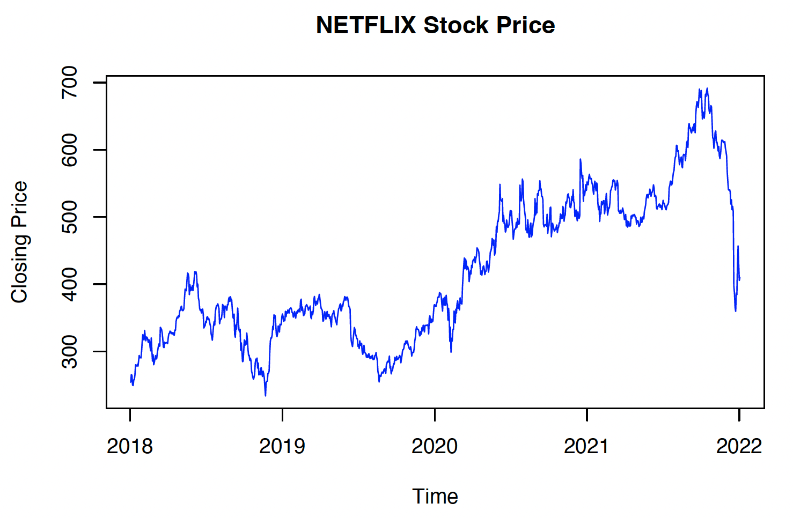
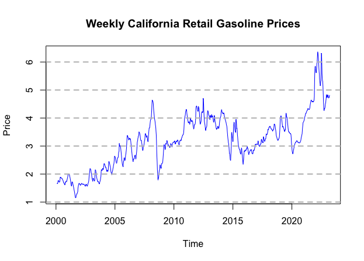

## About Me
Hi, I'm Sharon Lee!  
I'm currently pursuing my Master's in Applied Data Science at the University of Chicago, where I focus on applying machine learning, statistical modeling, and cloud-based tools to solde data-driven problems. I enjoy building scalable models and analytical workflows that bridge data, technology, and real-world impact.

* * *

## Education
**University of Chicago | Sep 2025 - Dec 2026**
- M.S., Applied Data Science  
  
**University of California, Santa Barbara | Sep 2021 - Jun 2024**
- B.S., Statistics and Data Science
- Minor in Spatial Studies

## Skills
- **Programming Languages**: Python, R, SQL, SAS
- **Programming Packages/Tools**: Pandas, NumPy, Matplotlib, TensorFlow, Keras, BeautifulSoup, LangChain
- **Other Skills**: Data Visualization, Machine Learning, Statistical Analysis, Jupyter Notebook, GIS, MS Excel

## Experience
**Data Scientist (Contract) @ NationBuilder | Jan 2024 - Jun 2024**
- Automated data extraction from customer websites through web scraping using BeautifulSoup in Python
- Preprocessed and analyzed 9,000+ customer records to prepare text data for classification
- Engineered and iteratively refined prompts for text classification tasks
- Implemented python pipeline for processing results in structured JSON format

**Research Assistant @ UCSB | Oct 2023 - Aug 2024**
- Performed cleaning and analysis of spatial data for agricultural economics research
- Visualized the geographic distribution of subsidized fields in Brazil using 95,000,000+ rows of dataset
- Developed an independent research project analyzing the effectiveness of Brazil’s ABC Plan in restoring degraded pastures, focusing on key indicators of soil carbon levels and pasture quality

**Data Team Staff @ Daily Nexus, UCSB | Mar 2022 - Dec 2023**
- Analyzed a wide range of topics including walkability across UC campuses and crime rates around the Santa Barbara community, collaborating with the editor team
- Utilized Python and ArcGIS to visualize heatmaps of walkability scores and report the findings

* * *  
## Projects  
### [Customer Classification Using Large Language Models](./nbproject)
- Developed an ontology system to enhance customer data categorization and improve organizational alignment
- Integrated OpenAI, Llama models and Groq API through LangChain for multi-LLM evaluation
- Achieved 98% alignment accuracy, validating the model's consistency across categories  
_Click the title to learn more._

### [NETFLIX Stock Forecasting](https://rpubs.com/sharon0708/nflxtimeseries)

- Applied ARIMA and GARCH models to analyze and forecast Netflix stock price trends using time series data  
- Developed and validated predictive models, achieving satisfactory results in diagnostic tests, including ACF, PACF, and Ljung-Box  
_Click the title to learn more._

### [Gasoline Prices Time Series](tsforecasting/vignette.html)
  
- Generated LSTM and ARIMA models to forecast future gasoline prices in California, employing machine learning techniques within R and TensorFlow  
- Evaluated model performance using Mean Absolute Error as a metric, determining the superior accuracy of LSTM models with MAE of 0.08 in capturing the volatile nature of gasoline prices  
_Click the title to learn more._

### [Airbnb Price Prediction](./PSTAT131-FinalProject.html)  
  
- Performed data cleaning, visualization, and machine learning with KNN, decision trees, and random forest
- Identified the random forest model as the most effective, achieving an RMSE of 8.1  
_Click the title to learn more._
