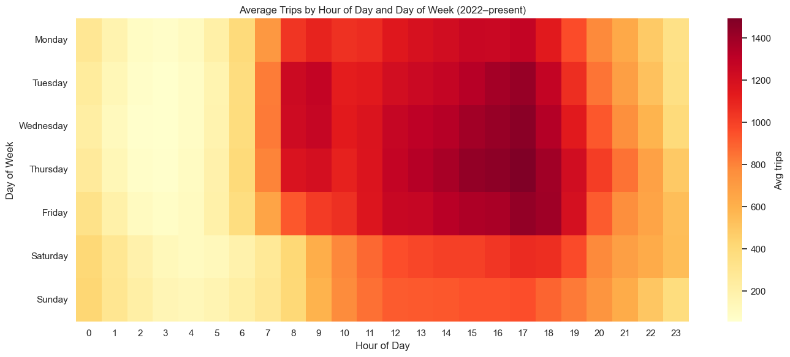
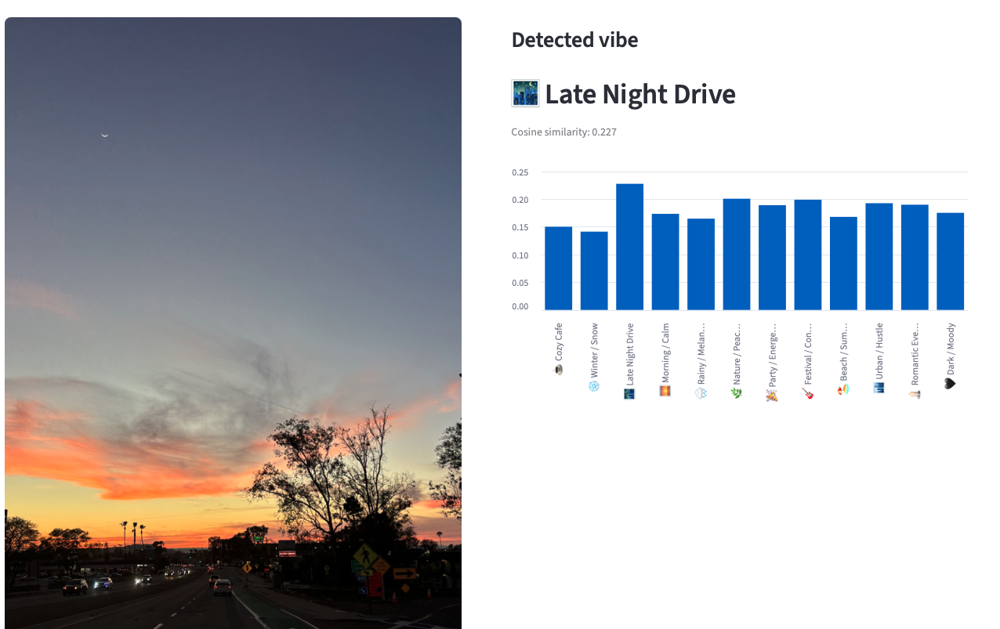
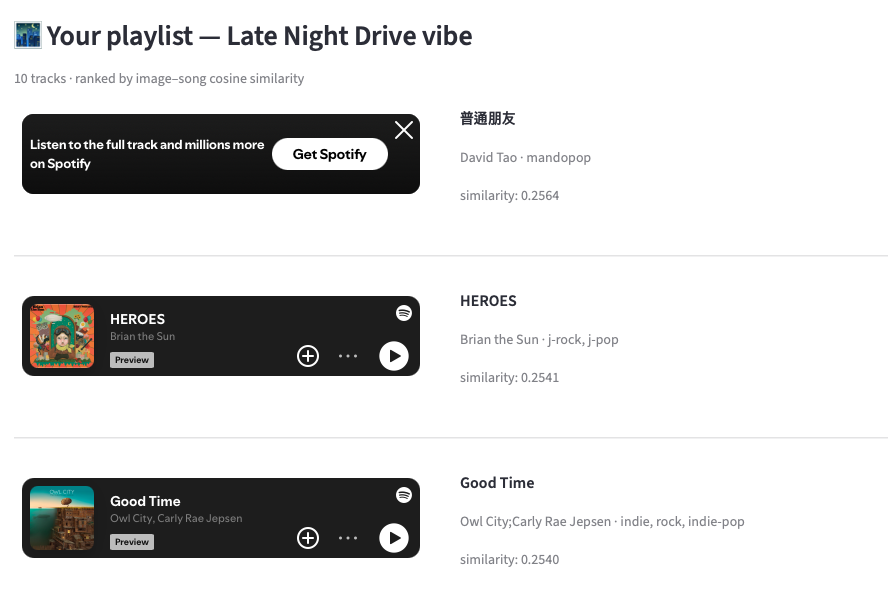
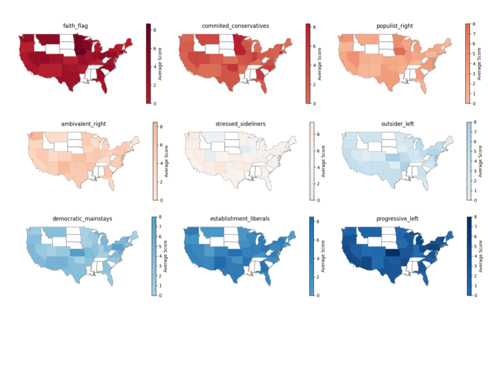
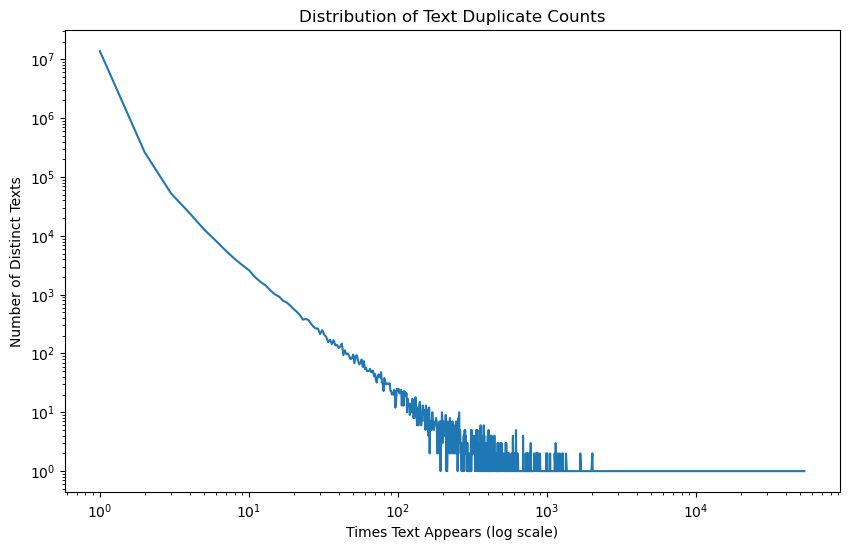

## About Me
I am pursuing an M.S. in Applied Data Science at the University of Chicago (expected December 2026) and am seeking full-time Data Scientist roles. My focus areas are machine learning, time series forecasting, and applied AI with large language models, with hands-on experience in large-scale and geospatial data. I am most interested in reading patterns in how people behave and using them to make decisions and processes more efficient.

[LinkedIn](https://linkedin.com/in/sharonlee07) · [GitHub](https://github.com/sharon-lee78) · sharonlee@uchicago.edu

[Projects](#featured-projects) · [Experience](#experience) · [Education](#education) · [Skills](#skills)

* * *

## Featured Projects

### [Chicago Taxi Demand Forecasting](https://github.com/sharon-lee78/taxi-demand-forecasting)

Forecasting hourly taxi demand in Chicago from 2022 onward, built from 30M+ trips aggregated with SoQL. A seasonal naive baseline (same hour last week) won 2/3 normal test windows against tuned Prophet and SARIMAX, but lost both New Year holiday windows, where copying last week no longer works.

*Python · Prophet · statsmodels · SoQL*

### [image2playlist: Photo-to-Playlist Recommendation](https://github.com/sharon-lee78/image2playlist)

Upload a photo and get a playlist that fits its mood. CLIP places the photo and 19K Spotify tracks, written out as short text descriptions, in the same embedding space, so songs can be matched to images without any paired training data. It identified the right vibe for 20 of 24 test images, and users rated its playlists higher than random and popularity baselines.

**My role:** I proposed the idea, designed the pipeline, set up the CLIP embeddings, defined the 12 vibe categories, and built the Streamlit app.

The live demo is offline because Spotify API access expired; screenshots are from an earlier run.

*Python · PyTorch · CLIP · Streamlit*

### [Classifying Organizations by Political Ideology with LLMs](./nbproject)

Capstone with NationBuilder. Scored website text from 325 organizations against Pew Research's nine-group political typology using prompted LLMs, with structured JSON output containing a score and quoted justification for each criterion. Results matched expert labels 98% of the time. The sponsor did not allow a code release, so the write-up covers what was presented at the showcase.

**My role:** I owned the political ideology track (the project also covered cause and religious ideology) and wrote the text preprocessing that feeds website content into the LLM pipeline.

*Python · LangChain · Llama 3 · GPT-4 · Groq*

### [Amazon Review Near-Duplicate Detection](./amazon)

Cleaned and profiled 64.7M Amazon reviews with PySpark on GCP Dataproc, then measured how often Automotive reviews repeat. 18.3% of review texts are exact copies of another review, mostly one-liners like "Good" and "Works great." For longer reviews, MinHash LSH on a 1% sample found near-duplicates (Jaccard similarity of 0.8 or higher) for 3.2% of reviews.

*PySpark · Spark MLlib · GCP Dataproc*

* * *

## Experience
**AI Engineer Intern, Bayesoft** | Jul 2026 – Present

- Evaluated an agentic AI feature across 20+ live test runs and gave the go/no-go recommendation.
- Audited the agent's prompts and backend logic, found two rule violations, and defined the required fixes.

**Data Scientist (Capstone), HERE Technologies** | Mar 2026 – Present

- Building a Python and QGIS pipeline that detects road network changes from large-scale GPS trajectory data, using DBSCAN as a baseline and testing other unsupervised spatial methods.

**AI Extern (Client: Wayfair), Extern** | Nov 2025 – Jan 2026

- Built three LLM agents in n8n that compare 50+ competitor listings on price and features, cutting manual research time by about 40%.

**Data Scientist (Industry Collaboration), NationBuilder** | Jan 2024 – Jun 2024

- Classified customer organizations with LLM prompts (GPT-4, Llama 3), reaching 98% agreement with expert labels.
- Automated website extraction and categorization for 9,000+ records in Python, cutting manual work by about 80%.

**Research Assistant, EDGE Lab, UCSB** | Oct 2023 – Sep 2024

- Built an R pipeline to measure soil carbon and pasture quality across Brazilian pastures, rebuilding land boundaries from 95M+ coordinate records and cutting processing time by about 70%.

* * *

## Education
**University of Chicago** | Sep 2025 – Dec 2026 (expected)  
M.S., Applied Data Science | GPA: 4.0  
*Relevant coursework:* Machine Learning I & II, Python for ML Engineering, Statistical Models, Time Series Analysis and Forecasting, Big Data and Cloud Computing, Advanced Computer Vision with Deep Learning, Generative AI: Principles & Applications (in progress), Bayesian Machine Learning with Generative AI Applications (in progress)

**University of California, Santa Barbara** | Sep 2021 – Jun 2024  
B.S., Statistics and Data Science; Minor in Spatial Studies | GPA: 3.74 (Major: 3.8)

* * *

## Skills

- **Languages:** Python, R, SQL, SAS
- **Machine Learning & Statistics:** scikit-learn, PyTorch, TensorFlow/Keras, statsmodels, Prophet
- **Data Processing:** pandas, NumPy, Spark (PySpark, MLlib), Hadoop, Hive
- **LLMs & AI Tools:** LangChain, OpenAI API, Llama 3, Groq, n8n
- **Visualization:** Matplotlib, Seaborn, Tableau, Power BI
- **Cloud & Deployment:** GCP (Dataproc, Cloud Storage), Docker, Linux, FastAPI, Streamlit, Git
- **Geospatial & Web Data:** QGIS, ArcGIS, BeautifulSoup

* * *

## Earlier Work
Undergraduate coursework in R.

- [Netflix Stock Forecasting](https://rpubs.com/sharon0708/nflxtimeseries): ARIMA and GARCH on daily NFLX prices, 2018–2022. The ARIMA forecast missed the January 2022 drop.
- [Airbnb Price Prediction, Los Angeles](./PSTAT131-FinalProject.html): Compared seven regression models on Inside Airbnb listings. Random forest did best (test RMSE about $89).
