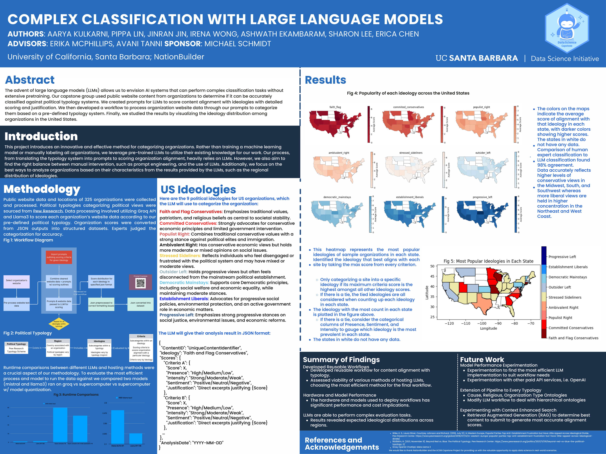

# Data Science Capstone: Classification with Large Language Models
### Sponsored by NationBuilder

## Abstract
The advent of large language models (LLMs) allows us to envision AI systems that can perform complex classification tasks withoutextensive pretraining. Our capstone group used public website content from organizations to determine if it can be accuratelyclassified against political typology systems. We created prompts for LLMs to score content alignment with ideologies with detailedscoring and justification. We then developed a workflow to process organization website data through our prompts to categorizethem based on a pre-defined typology system. Finally, we studied the results by visualizing the results by visualizing the ideology distribution among organizations in the United States.

## Introduction
This project introduces an innovative and effective method for categorizing organizations. Rather than training a machine learning model

