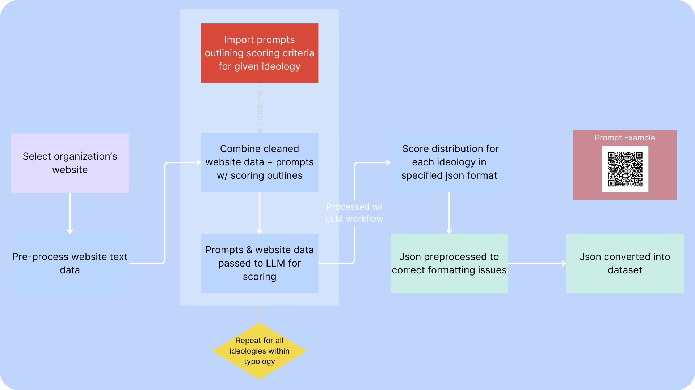
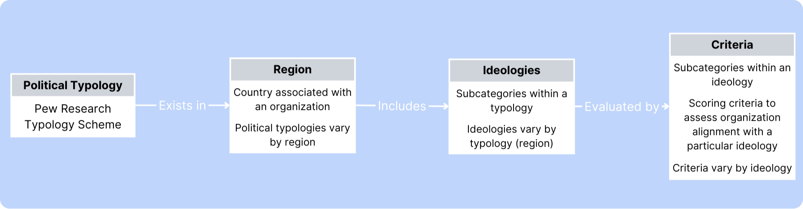
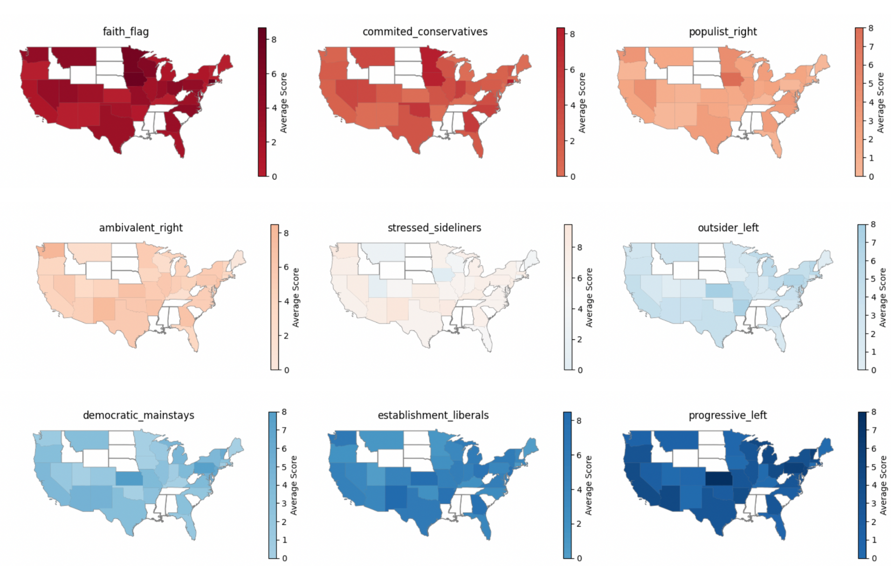

# UCSB Data Science Capstone: Classification with Large Language Models
### Sponsored by NationBuilder


## Abstract
The advent of large language models (LLMs) allows us to envision AI systems that can perform complex classification tasks withoutextensive pretraining. Our capstone group used public website content from organizations to determine if it can be accuratelyclassified against political typology systems. We created prompts for LLMs to score content alignment with ideologies with detailedscoring and justification. We then developed a workflow to process organization website data through our prompts to categorizethem based on a pre-defined typology system. Finally, we studied the results by visualizing the results by visualizing the ideology distribution among organizations in the United States.

## Introduction
This project introduces an innovative and effective method for categorizing organizations. Rather than training a machine learning model or manually labeling all organizations, we leverage pre-trained LLMs to utilize their existing knowledge for our work. Our process, from translating the typology system into prompts to scoring organization alignment, heavily relies on LLMs. However, we also aim to find the right blance between manual intervention, such as prompt engineering, and the use of LLMs. Additionally, we focus on the best ways to anlyze organizations based on their characteristics from the results provided by the LLMs, such as the regional distribution of ideologies.

## Methodology  
Public website data and locations of 325 organizations were collected and processed. Political typologies categorizing political views were sourced from [Pew Research](https://www.pewresearch.org/politics/2021/11/09/beyond-red-vs-blue-the-political-typology-2/). Data processing involved utilizing Groq API and Llama3 to score each organization's website data according to our pre-defined political typology. Organization scores were converted from JSON outputs into structured datasets. Experts juded the categorization for accuracy.

> Figure 1: Workflow Diagram



> Figure 2: Political Typology

  

Runtime comparisons between different LLMs and hosting methods were a crucial aspect of our methodology. To evaluate the most efficient process and model to run the data against we compared two models (Mistral and Llama3) ran on groq vs supercomputer vs supercomputer with model quatization.

> Figure 3: Runtime Comparisons


## US Ideologies  
Here are the 9 political ideologies for US organizations, which the LLM will use to categorize the organization:
- **Faith and Flag Conservatives**: Emphasizes traditional values, patriotism, and religious beliefs as central to societal stability.
- **Committed Conservatives**: Strongly advocates for conservative economic principles and limited government intervention.
- **Populist Right**: Combines traditional conservative values with a strong stance against political elites and immigration.
- **Ambivalent Right**: Has conservative economic views but holds more moderate or mixed opinions on social issues.
- **Stressed Sideliners**: Reflects individuals who feel disengaged or frustrated with the political system and may have mixed or moderate views.
- **Outsider Left**: Holds progressive views but often feels disconnected from the mainstream political establishment.
- **Democratic Mainstays**: Supports core Democratic principles, including social welfare and economic equality, while maintaining moderate stances.
- **Establishment Liberals**: Advocates for progressive social policies, environmental protection, and an active government role in economic matters.
- **Progressive Left**: Emphasizes strong progressive stances on social justice, environmental issues, and economic reforms.

The LLM will give their analysis result in JSON format:

```
{
"ContentID": "UniqueContentIdentifier",
"Ideology": "Faith and Flag Conservatives",
"Scores": {
  "Criteria A": {
    "Score": X,
    "Presence": "High/Medium/Low",
    "Intensity": "Strong/Moderate/Weak",
    "Sentiment": "Positive/Neutral/Negative",
    "Justification": "Direct excerpts justifying {Score}
  },
  "Criteria B": {
    "Score": X,
    "Presence": "High/Medium/Low",
    "Intensity": "Strong/Moderate/Weak",
    "Sentiment": "Positive/Neutral/Negative",
    "Justification": "Direct excerpts justifying {Score}
  },
...
  },
"AnalysisDate": "YYYY-MM-DD"
}
```

## Results
> Figure 4: Popularity of Each Ideology across the United States


The colors on the maps indicate the average score of alignment with that ideology in each state, with darker colors showing higher scores. The states in white do not have any data. Comparison of human expert classification to LLM classification found _98%_ agreement. Data accurately reflects higher levels of conservative views in the Midwest, South, and Southwest whereas more liberal views are held in higher concentration in the Northeast and West Coast.  

> Figure 5: Most Popular Ideologies in Each State


This heatmap represents the most popular ideologies of sample organizations in each state. The ideology that aligns best with each site is identified by taking the max score from every criterion. A site is categorized into a specific ideology if its maximum criteria score is the highest amongst all other ideology scores. If there is a tie, the tied ideologies are all considered when counting up each ideology in each state. Also, the categorical columns of Presence, Sentiment, and Intensity are considered to gauge which ideology is the most prevalent in each state. The states in white do not have any data.

## Summary of Findings
- We developed reusable workflows for content alignment with typology and assessed viability of various methods of hosting LLMs, chossing the most efficient method for the final workflow.
- The hardware and models used to deploy workflows has significant performance and cost implications.
- Results revealed expected ideological distribution across regions.


### Reference
- Wike, K. S., Laura Silver, Courtney Johnson and Richard. (2018, July 12). In Western Europe, Populist Parties Tap Anti-Establishment Frustration but Have Little Appeal Across Ideological Divide. Pew Research Center. https://www.pewresearch.org/global/2018/07/12/in-western-europe-populist-parties-tap-anti-establishment-frustration-but-have-little-appeal-across-ideological- divide/ 
- Nadeem, R. (2021, November 9). Beyond Red vs. Blue: The Political Typology. Pew Research Center. https://www.pewresearch.org/politics/2021/11/09/beyond-red-vs-blue-the-political- typology-2/ 
- Groq, OpenAI ChatGpt, Meta Llama 3  

  

