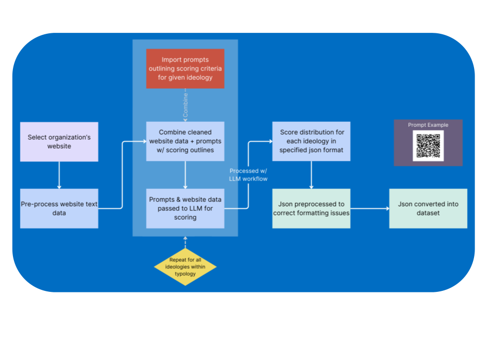
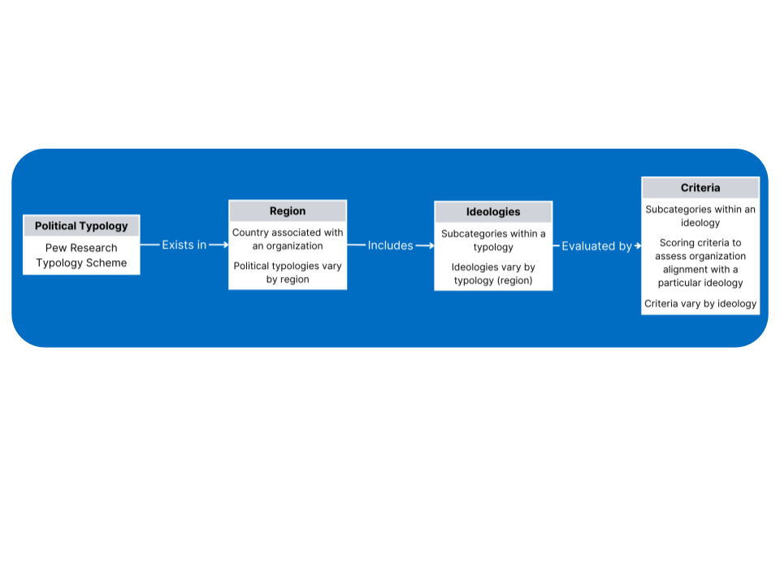
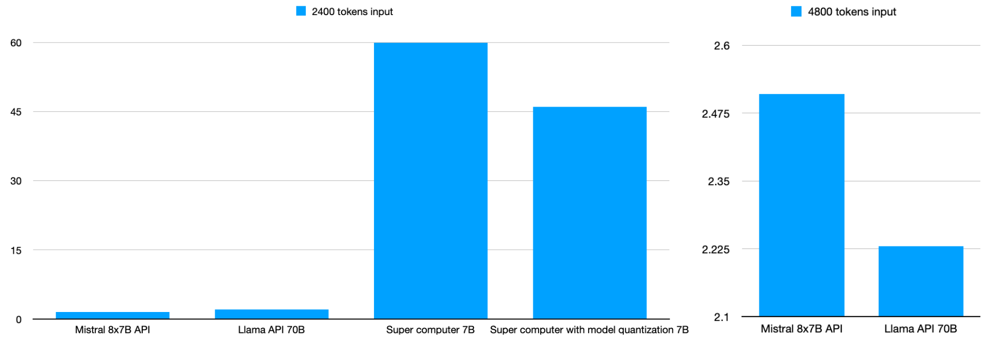
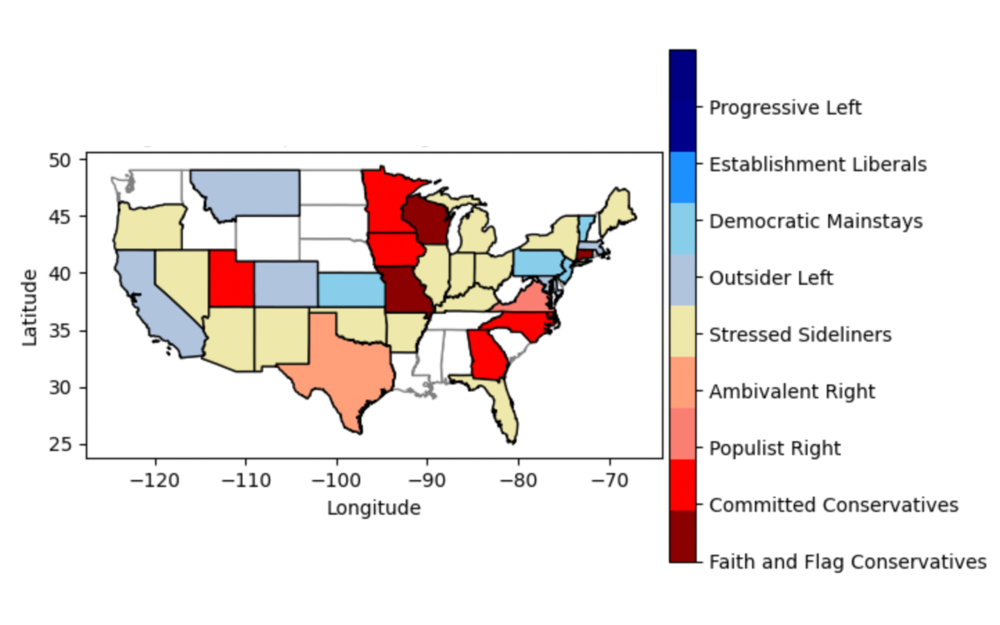

# Classifying Organizations by Political Ideology with LLMs
#### Capstone with NationBuilder, UC Santa Barbara | Jan – Jun 2024
#### Authors: Sharon Lee, Aarya Kulkarni, Pippa Lin, Jinran Jin, Irena Wong, Ashwath Ekambaram, Erica Chen

## Abstract
The advent of large language models (LLMs) allows us to envision AI systems that can perform complex classification tasks without extensive pretraining. Our capstone group used public website content from organizations to test whether it can be accurately classified against a political typology. We wrote prompts that ask an LLM to score how closely the content aligns with each ideology and to justify each score. We then built a workflow that runs each organization's website text through these prompts and categorizes it under a predefined typology. Finally, we visualized how ideologies are distributed among organizations across the United States.

## Introduction
This project tests a way of categorizing organizations without labeled training data. Rather than training a model or labeling every organization by hand, we use pretrained LLMs and the knowledge they already have. Our process, from translating the typology system into prompts to scoring organization alignment, heavily relies on LLMs. We also looked for the right balance between manual work, such as prompt engineering, and what the LLM handles on its own. Finally, we looked at what the LLM results say about organizations as a group, such as how ideologies are distributed by region.

## Methodology  
Public website data and locations of 325 organizations were collected and processed. Political typologies categorizing political views were sourced from [Pew Research](https://www.pewresearch.org/politics/2021/11/09/beyond-red-vs-blue-the-political-typology-2/). Prompts were designed and iterated with GPT, and LangChain was used to apply the same criteria across the workflow. The combined prompt and each organization's website text were then run on Llama 3 through the Groq API to score the organization against the typology. The JSON outputs were cleaned and converted into a structured dataset, and domain experts reviewed the categorizations for accuracy.

> Figure 1: Workflow Diagram



> Figure 2: Political Typology

  

We also compared runtime across models and hosting setups to choose the most efficient way to run the workflow: Mistral 8x7B and Llama 3 70B through the Groq API, and a 7B model on a supercomputer with and without quantization. The API-hosted models ran far faster than the self-hosted 7B model, and quantization cut the self-hosted runtime by roughly a quarter. Note that the setups use different model sizes, so this compares practical options rather than models of equal size.

> Figure 3: Runtime by model and hosting setup (lower is faster). The right panel's axis starts at 2.1, so the gap between the two API models looks larger than it is.



## US Ideologies  
These are the nine groups in Pew Research's 2021 political typology, which the LLM used to categorize each organization:

- **Faith and Flag Conservatives**: Emphasizes traditional values, patriotism, and religious beliefs as central to societal stability.
- **Committed Conservatives**: Strongly advocates for conservative economic principles and limited government intervention.
- **Populist Right**: Combines traditional conservative values with a strong stance against political elites and immigration.
- **Ambivalent Right**: Has conservative economic views but holds more moderate or mixed opinions on social issues.
- **Stressed Sideliners**: Reflects individuals who feel disengaged or frustrated with the political system and may have mixed or moderate views.
- **Outsider Left**: Holds progressive views but often feels disconnected from the mainstream political establishment.
- **Democratic Mainstays**: Supports core Democratic principles, including social welfare and economic equality, while maintaining moderate stances.
- **Establishment Liberals**: Advocates for progressive social policies, environmental protection, and an active government role in economic matters.
- **Progressive Left**: Emphasizes strong progressive stances on social justice, environmental issues, and economic reforms.

The LLM returns its analysis in this JSON format:

```
{
"ContentID": "UniqueContentIdentifier",
"Ideology": "Faith and Flag Conservatives",
"Scores": {
  "Criteria A": {
    "Score": X,
    "Presence": "High/Medium/Low",
    "Intensity": "Strong/Moderate/Weak",
    "Sentiment": "Positive/Neutral/Negative",
    "Justification": "Direct excerpts justifying {Score}"
  },
  "Criteria B": {
    "Score": X,
    "Presence": "High/Medium/Low",
    "Intensity": "Strong/Moderate/Weak",
    "Sentiment": "Positive/Neutral/Negative",
    "Justification": "Direct excerpts justifying {Score}"
  },
...
  },
"AnalysisDate": "YYYY-MM-DD"
}
```

## Results
> Figure 4: Average alignment score for each ideology by state


Each map shows the average alignment score with one ideology in each state, with darker colors showing higher scores. Each map uses its own color scale, so colors can be compared between states within a map but not across maps. The states in white do not have any data. Within each map, differences between states are small, and with 325 organizations in total some states have only a few, so state-level differences should be read loosely. When compared with expert classifications, the LLM classifications agreed 98% of the time.  

> Figure 5: Most Popular Ideologies in Each State


This heatmap represents the most popular ideologies of sample organizations in each state. The ideology that aligns best with each site is identified by taking the max score from every criterion. A site is categorized into a specific ideology if its maximum criteria score is the highest amongst all other ideology scores. If there is a tie, the tied ideologies are all considered when counting up each ideology in each state. Also, the categorical columns of Presence, Sentiment, and Intensity are considered to gauge which ideology is the most prevalent in each state. The states in white do not have any data.

## Summary of Findings
- We built a reusable workflow for scoring content against a typology, and compared ways of hosting LLMs to choose the most efficient one for the final workflow.
- The choice of model and hardware has a large effect on runtime and cost.
- LLM classifications agreed with expert labels 98% of the time.


### Reference
- Simmons, K., Silver, L., Johnson, C., & Wike, R. (2018, July 12). In Western Europe, Populist Parties Tap Anti-Establishment Frustration but Have Little Appeal Across Ideological Divide. Pew Research Center. https://www.pewresearch.org/global/2018/07/12/in-western-europe-populist-parties-tap-anti-establishment-frustration-but-have-little-appeal-across-ideological-divide/ 
- Nadeem, R. (2021, November 9). Beyond Red vs. Blue: The Political Typology. Pew Research Center. https://www.pewresearch.org/politics/2021/11/09/beyond-red-vs-blue-the-political-typology-2/ 
- Groq, OpenAI GPT, Meta Llama 3  
