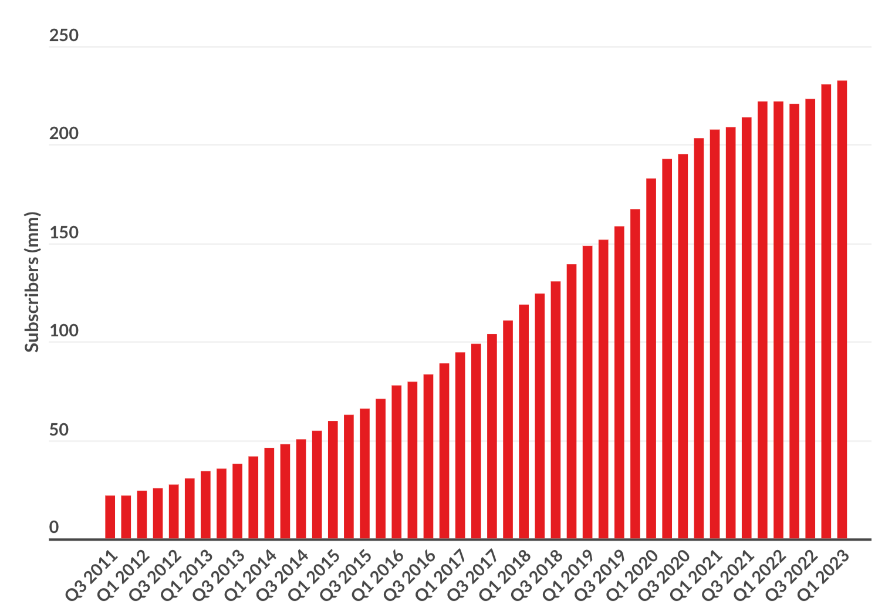

# NETFLIX Stock Time Series  
### UCSB PSTAT 174 Project  
### 06/05/2023  

## Abstract
This project aims to analyze time series models to forecast the future performance of Netflix’s stock price (NFLX). The dataset covers the period from 2018 to 2022, offering insights into the changes in NFLX’s price over time. The analysis focuses on comparing SARIMA (Seasonal Autoregressive Integrated Moving Average) and GARCH (Generalized Autoregressive Conditional Heteroskedasticity) models to evaluate their predictive accuracy. By comparing the predicted values to actual values, the performance of these models is assessed to determine the most reliable forecasting method.  

## Introduction  
This project focuses on analyzing and forecasting Netflix's stock price. The goal is to produce accurate predictions of Netflix’s future stock price by applying two models—SARIMA and GARCH—on historical stock price data.

Netflix is a global leader in streaming services, with over 233 million paid memberships as of 2023, spanning more than 190 countries. I selected Netflix’s stock (NFLX) because of its prominent role in the market and its widespread use in everyday life. As Netflix has experienced significant growth in both revenue and subscribers, its stock price has garnered substantial attention from investors.  
> Figure 1: Netflix Quarterly Revenue 2011 to 2022 (mm)



In this project, SARIMA and GARCH models are applied to a training dataset to analyze the stock price of NFLX. We examine the Autocorrelation Function (ACF) and Partial Autocorrelation Function (PACF) plots to identify key features, such as trends, seasonality, stationarity, and the need for data transformations. Once the optimal model parameters are determined, diagnostic checks are performed to select the best-fitting model.

## Data  
The dataset used for analyzing Netflix's stock price was obtained from [Kaggle](https://www.kaggle.com/datasets/jainilcoder/netflix-stock-price-prediction) and sourced from Yahoo Finance. It contains daily stock prices (in U.S. dollars) for Netflix (NFLX) from February 5, 2018, to February 4, 2022. The dataset includes 1,009 observations across seven variables: Date, Open, High, Low, Close, Adjusted Close, and Volume.  
```
##         Date   Open   High   Low   Close Adj.Close   Volume
## 1 2018-02-05 262.00 267.90 250.03 254.26    254.26 11896100
## 2 2018-02-06 247.70 266.70 245.00 265.72    265.72 12595800
## 3 2018-02-07 266.58 272.45 264.33 264.56    264.56  8981500
## 4 2018-02-08 267.08 267.62 250.00 250.10    250.10  9306700
## 5 2018-02-09 253.85 255.80 236.11 249.47    249.47 16906900
## 6 2018-02-12 252.14 259.15 249.00 257.95    257.95  8534900
```
In this analysis, the Close price is used as it represents the final trading price during business hours, providing a comprehensive reflection of the stock's value. This dataset is particularly significant because it spans a period where Netflix’s stock price exhibited substantial growth, including its highest historical peak. The lowest stock price within this period was $233.88 on December 24, 2018, and the highest was $691.69 on November 17, 2021.  
It’s also important to note that the dataset frequency is 252 trading days per year rather than the standard 365 days, as the stock market does not operate on weekends or holidays.

## Methodology  
### SARIMA (p, d, q) x (P, D, Q)s Model  
The SARIMA (Seasonal Autoregressive Integrated Moving Average) model is an extension of the ARIMA model, designed to handle time series data with both seasonal patterns and non-stationary characteristics. SARIMA requires the specification of two parameter sets: the non-seasonal parameters (p, d, q) and the seasonal parameters (P, D, Q), along with the seasonal period (s).
- **(p, d, q)**:
  - _p_: The order of autoregressive (AR) terms
  - _d_: The number of differences required to achieve stationarity
  - _q_: The order of moving average (MA) terms
 - **(P, D, Q)**:
   - _P_: The order of the seasonal autoregressive part
   - _D_: The number of seasonal differences
   - _Q_: The order of the seasonal moving average part
- **s**: The length of theseasonal cycle in the data

To determine the optimal parameters for the SARIMA model, we analyze the Autocorrelation Function (ACF) and Partial Autocorrelation Function (PACF) plots. After selecting several models, we use criteria such as Akaike Information Criterion (AIC) and Bayesian Information Criterion (BIC) to identify the best-fitting model.
  
### GARCH Model  
The GARCH (Generalized Autoregressive Conditional Heteroskedasticity) model is an extension of the ARCH model, frequently used to model financial data with periods of high volatility clustered together. GARCH captures time-varying volatility by using an autoregressive structure for the conditional variance.

To fit the GARCH model, we first apply an AR model to the dataset and analyze the ACF of the squared residuals. Diagnostic tests are conducted to confirm the validity of the GARCH model. In this project, we use the AR(8) model, selected based on the earlier analysis, to capture the volatility dynamics and forecast stock price fluctuations.

## Results  
### Results from SARIMA (p, d, q) x (P, D, Q)

To begin, the time series of Netflix’s stock price was set up using the NFLX dataset, with a frequency of 252 trading days per year (since the stock market only operates on weekdays). Over the five-year period, the stock price shows an overall upward trend, without a clear seasonal pattern.


